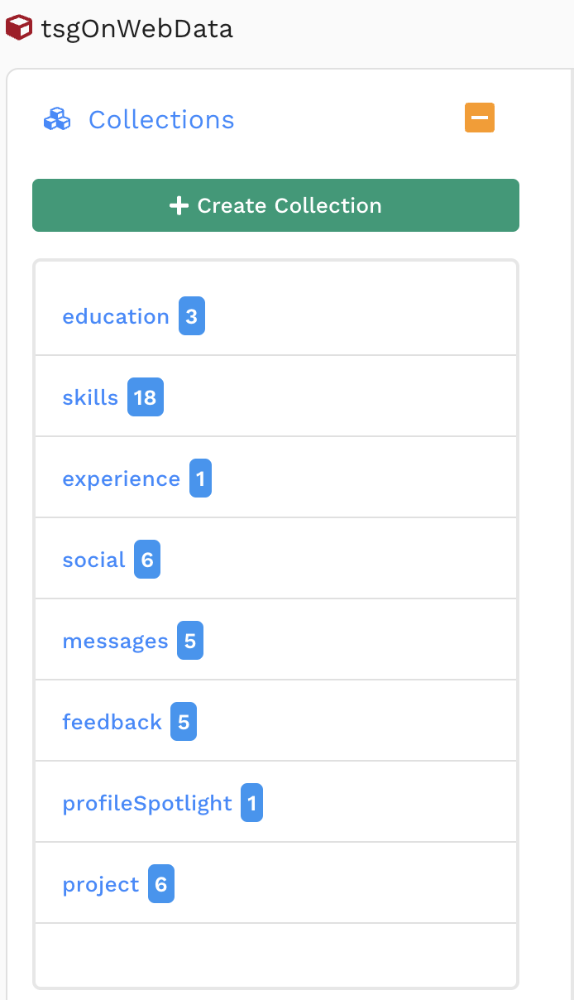
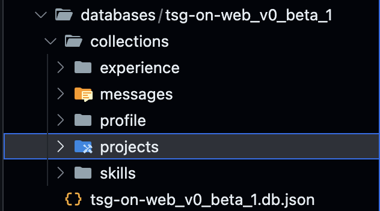
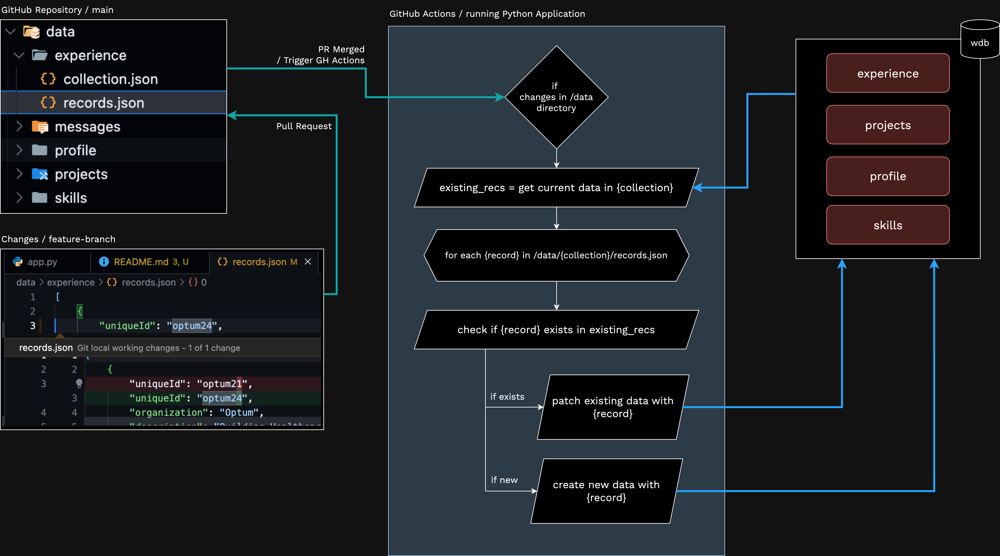
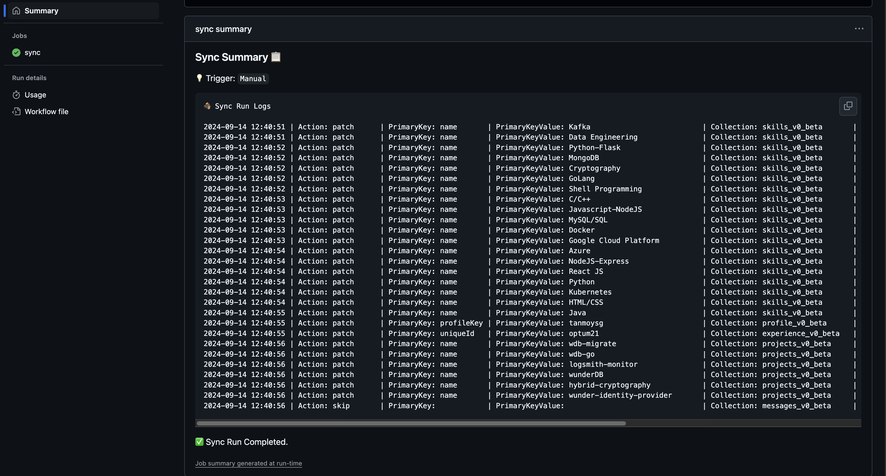

# Updating Data for tanmoysg.com to wunderDb Collections using GitOps

This document explains the architectural design and thought process behind data management using **GitOps**.

## Preface

The personal website’s data (such as social media accounts, profile details, etc.) is mostly static and unchanging. Therefore, maintaining a highly segregated database structure is unnecessary. We have migrated from an older, domain-separated database design (with different collections for social media profiles, education, profile highlights, etc.) to a consolidated approach where such static data is combined into a single collection.

### Comparison of Data Design

| Older Database Design              | New Database Design                |
| ---------------------------------- | ---------------------------------- |
|  |  |

### Collections Comparison

| Collections (Old)                   | Collections (New)                                                                                     |
|-------------------------------------|------------------------------------------------------------------------------------------------------|
| skills                              | [skills](../schema/databases/tsg-on-web_v0_beta_1/collections/skills/skills.schema.json)             |
| projects                            | [projects](../schema/databases/tsg-on-web_v0_beta_1/collections/projects/projects.schema.json)       |
| education, social, profileSpotlight | [profile](../schema/databases/tsg-on-web_v0_beta_1/collections/profile/profile.schema.json)          |
| messages, feedback                  | [messages](../schema/databases/tsg-on-web_v0_beta_1/collections/messages/messages.schema.json)       |
| experience                          | [experience](../schema/databases/tsg-on-web_v0_beta_1/collections/experience/experience.schema.json) |

Note how collections like `education`, `profileSpotlight`, and `social` have been merged into the new `profile` schema, while `messages` and `feedback` have been consolidated into a single `messages` collection.

## Why Use GitOps to Push Data?

Since this data is mostly static and stored in JSON files, managing the data through Git is straightforward. These JSON files are not large, and maintaining them as single objects is efficient.

To make the data available via API calls, it is pushed into [wunderDb](https://github.com/TanmoySG/wunderDB). This setup simplifies the process of managing data in JSON form. The idea is to eliminate the need for manual database updates when files change. GitOps enables automatic data updates whenever there are changes to the JSON files in the repository.

You can learn more about GitOps [here](https://about.gitlab.com/topics/gitops/).

## GitOps Architecture



- For any change in records a pull request (PR) is raised for the main branch.
- When the PR is merged, the [`data-sync`](../.github/workflows/data-sync.yaml) workflow is triggered, running only if there are changes to the `/data` directory.
- Each directory under `/data` corresponds to a collection.
- The workflow runs a Python script, [`push`](app.py), that checks records in each collection.
- It updates existing records or creates new ones if they don’t exist in the database.

**Note**: Since there are relatively few records, patching all fields saves on computational overhead for field-level comparisons. This tradeoff is acceptable when there are less records.

## Workflow Overview

The [`data-sync.yaml`](../.github/workflows/data-sync.yaml) configuration defines the steps for syncing data.

### Workflow Triggers

```yaml
name: Sync Data

on:
  workflow_dispatch:
    inputs:
      confirm:
        type: boolean
        description: 'Confirm Manual Trigger for Sync Job'
        required: true
  push:
    branches: ['main']
    paths: ['data/*/records.json']
```

- **`push` trigger**: Runs the workflow when:
  - There’s a push to the `main` branch.
  - There are changes in `/data/*/records.json` (i.e., records in the `/data` directory).
  - The workflow won't run if BOTH the conditions are not met.

- **`workflow_dispatch` trigger**: This allows manual triggering of the workflow.

### Job Setup Steps

```yaml
jobs: 
  sync: 
    runs-on: ubuntu-latest 
    steps: 
      - name: Checkout Repository
        uses: actions/checkout@v4
      - name: Set up Python 
        uses: actions/setup-python@v5
        with:
            python-version: '3.11'
```

- **`runs-on`**: Specifies that the job runs on an Ubuntu runner.
- **`Checkout Repository`**: Checks out the repository using the action [`actions/checkout@v4`](https://github.com/actions/checkout).
- **`Set up Python`**: Sets up Python 3.11 on the runner using [`actions/setup-python@v5`](https://github.com/actions/setup-python).

### Build and Run Step

```yaml
      - name: Build and Run 
        env: 
            BASE_URL: ${{ secrets.BASE_URL }}
            WDB_USERNAME: ${{ secrets.WDB_USERNAME }} 
            WDB_PASSWORD: ${{ secrets.WDB_PASSWORD }} 
        run: | 
            echo '### Sync Summary 📋' >> $GITHUB_STEP_SUMMARY
            trigger=$(echo ${{ github.event_name }})
            if [ $trigger == "workflow_dispatch" ]; then
              echo '💡 Trigger: `Manual`' >> $GITHUB_STEP_SUMMARY
            elif [ $trigger == "push" ]; then
              echo '💡 Trigger: `Record(s) Updated`' >> $GITHUB_STEP_SUMMARY
            fi
            cd ${GITHUB_WORKSPACE}/push
            pip install -r requirements.txt
            echo '```' >> $GITHUB_STEP_SUMMARY
            echo "🪵 Sync Run Logs" >> $GITHUB_STEP_SUMMARY
            echo >> $GITHUB_STEP_SUMMARY
            python3 app.py
            cat push.log 
            cat push.log >> $GITHUB_STEP_SUMMARY
            echo '```' >> $GITHUB_STEP_SUMMARY
            echo "✅ Sync Run Completed." >> $GITHUB_STEP_SUMMARY
```

- **Environment Variables**: Secrets like `BASE_URL`, `WDB_USERNAME`, and `WDB_PASSWORD` are fetched from the repository secrets.
- **Summary Logs**: The `echo` commands push a markdown summary to the `STEP SUMMARY` section of the GitHub UI.
- **Trigger Handling**: Depending on the trigger (manual or push), different messages are displayed in the step summary.

### Application Execution

```shell
cd ${GITHUB_WORKSPACE}/push
pip install -r requirements.txt
... # commands for step output
python3 app.py
cat push.log
```

- Navigate to the `/push` directory where the application is located.
- Install the dependencies from `requirements.txt`.
- Run the Python script `app.py` to perform the data sync.
- The logs are saved in `push.log` and displayed in the GitHub workflow run.
- Push the saved logs into step summary.

### Logs in Step Summary

```shell
echo '```' >> $GITHUB_STEP_SUMMARY
echo "🪵 Sync Run Logs" >> $GITHUB_STEP_SUMMARY
echo >> $GITHUB_STEP_SUMMARY
... # python commands
cat push.log >> $GITHUB_STEP_SUMMARY
echo '```' >> $GITHUB_STEP_SUMMARY
echo "✅ Sync Run Completed." >> $GITHUB_STEP_SUMMARY
```

- This pushes the logs into the step summary for easy visibility.



Read more about GitHub’s Step Summary feature [here](https://docs.github.com/en/actions/writing-workflows/choosing-what-your-workflow-does/workflow-commands-for-github-actions#adding-a-job-summary).

PS: I learnt about step summary while working on this workflow! 😄
